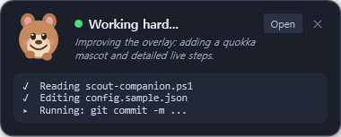

# Scout Companion

A lightweight desktop overlay for the **Microsoft Scout** / **OpenClaw** AI agent.

When the agent is working and you've looked away — minimized its window or switched
to another app — Scout Companion pops up a small toast in the corner of your screen
that shows **what the agent is doing right now**. If the agent asks for a permission
("Allow this command?"), you can **Allow or Deny it with one click**, without switching
back to the agent window.

> **Unofficial community project.** Not affiliated with, endorsed by, or supported by
> Microsoft. Use at your own risk. MIT licensed.



---

## Why

The desktop agent only shows its live progress and approval prompts inside its own
window. If you minimize it or focus another app while it runs a long task, you have to
keep switching back to check progress or to approve the next step. Scout Companion
mirrors that information into an always-on-top toast and lets you act on approvals in
place.

## Features

- **Live progress toast** — streams the agent's current activity as readable steps
  (e.g. "Reading config.json", "Running: git commit ...") with a ✓/▸ status list, plus
  the agent's latest narration.
- **Cheerful animated mascot** — a quokka that bobs and "types" while the agent is busy,
  and gently breathes when idle, so you can tell at a glance whether work is happening.
- **One-click approvals** — surfaces pending permission requests and clicks the real
  Allow/Deny button inside the agent window for you (via UI Automation — no need to
  bring the window to the foreground).
- **Smart visibility** — stays hidden while the agent window is focused; appears only
  when the agent is busy *and* you've looked away, or whenever an approval is pending.
- **Zero personal data, zero config** — discovers the agent home folder, the active
  session, and the agent window automatically at runtime. Nothing is hardcoded.
- **Single file, no install** — pure PowerShell + WPF. No dependencies, no build step.

## Requirements

- Windows 10/11
- PowerShell 5+ (ships with Windows) — the launcher runs it in `-STA` mode for WPF
- Microsoft Scout or OpenClaw desktop app installed and running

## Install & run

1. Download/clone this repo anywhere.
2. Double-click **`Start-ScoutCompanion.cmd`**.

That's it. The toast stays hidden until the agent is working in the background. To run
it automatically at login, put a shortcut to `Start-ScoutCompanion.cmd` in your Startup
folder (`Win`+`R` → `shell:startup`).

To stop it: click the **✕** on the toast (hides it until the next approval), or close
the background PowerShell process from Task Manager.

## How it works

The agent writes a per-session event stream to:

```
%USERPROFILE%\.copilot\session-state\<session-id>\events.jsonl
```

Scout Companion:

1. Finds the **active session** (the one currently locked / most recently written).
2. **Tails `events.jsonl`** and interprets events:
   - `tool.execution_start` / `assistant.message` → current activity text
   - `permission.requested` / `permission.completed` → pending approvals
3. Detects the **agent window** from the running process list and checks whether it's
   minimized or in the foreground to decide when to show the toast.
4. For approvals, it wakes the agent window's accessibility tree and invokes the
   matching **Allow/Deny** button through Windows UI Automation.

No network calls. No data leaves your machine. The companion only reads local files and
interacts with the local agent window.

## Configuration (optional)

Everything works out of the box. To customize, copy `config.sample.json` to
`config.json` (next to the script) and edit. Common overrides:

| Field | Default | Purpose |
|-------|---------|---------|
| `home` | `%USERPROFILE%\.copilot` | Agent home folder |
| `processNames` | `["Microsoft Scout","OpenClaw",...]` | Agent window process names |
| `allowLabels` / `denyLabels` | `["Allow",...]` / `["Deny",...]` | Buttons to click for approvals |
| `activeWindowSeconds` | `150` | How long after the last event the session counts as "working" |
| `pollIntervalMs` | `700` | Event/focus polling interval |

You can also point it at a different home folder with the `SCOUT_COMPANION_HOME`
environment variable.

`config.json` is git-ignored so your local tweaks never get committed.

## Troubleshooting

- **Toast never appears** — make sure the agent is actually running a task. The toast is
  intentionally hidden while the agent window is focused. Minimize it and start a task.
- **"Agent not detected"** — your build may use a different process name; add it to
  `processNames` in `config.json`.
- **Allow/Deny clicks the wrong thing or does nothing** — the button captions in your
  build may differ; adjust `allowLabels` / `denyLabels`. Scout currently shows **Allow**,
  **Allow for session**, **Allow everywhere**, and **Deny**; the toast's **Allow** maps to
  the safest one-time **Allow**. As a fallback the companion focuses the agent window so
  you can click manually.

## Privacy & safety

- Reads only local session files and the local agent window. No telemetry, no network.
- Clicking **Allow** here is exactly equivalent to clicking Allow in the agent — it does
  not bypass any of the agent's own permission checks; it just forwards your click.
- Treat approvals with the same care you would in the agent itself.

## License

[MIT](LICENSE)
