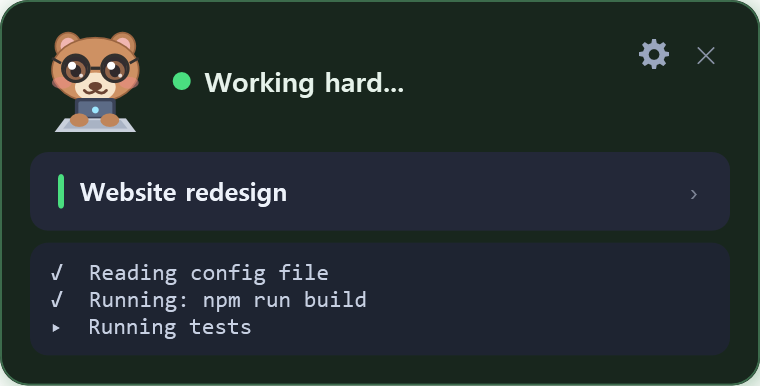
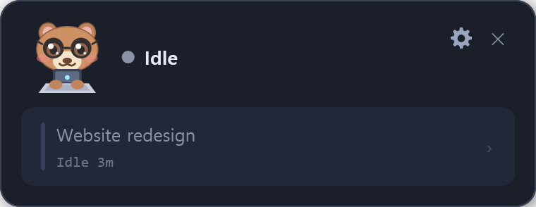
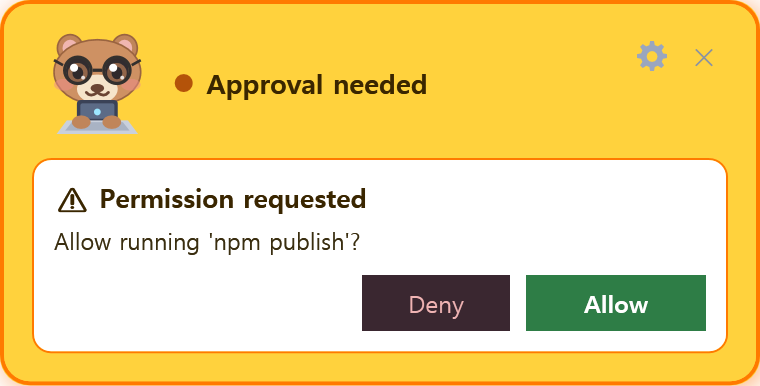
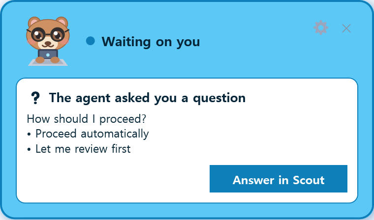
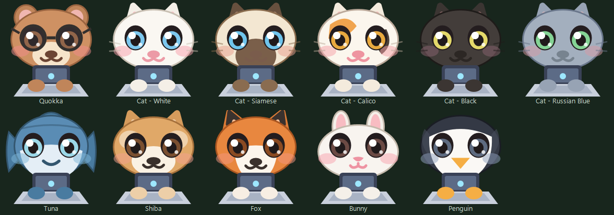

<div align="center">

# 🐻 Scout Companion

**A tiny desktop overlay for the [Microsoft Scout](https://aka.ms/scout) / OpenClaw AI agent.**

When the agent is working and you've looked away, a small toast in the corner shows
**what it's doing right now** — and lets you **Allow or Deny** its prompts with one click,
without switching back.

> **Optional voice control:** open Settings and use the
> **VOICE CONTROL** section to enable command input and, independently, spoken
> answers. Recognized commands are typed into the currently visible Scout
> conversation, and the answer from that same turn is read back. Both choices
> and the 0-100 wake-word and ambient-noise sensitivity controls are stored in
> `config.json`; the voice engine follows Companion's lifetime. First-time users can run the five-phrase
> voice enrollment from the same settings section; raw recordings are discarded
> and only the encrypted speaker profile is retained. The enrollment UI,
> recognizer, and five prompts follow the selected language.


</div>

> [!NOTE]
> **Unofficial community project.** Not affiliated with, endorsed by, or supported by
> Microsoft. Use at your own risk. MIT licensed.

---

## Status at a glance

The whole toast changes colour so you can read the agent's state from across the room —
no need to look at the text.

| State | Colour | What it means | Preview |
|-------|--------|---------------|---------|
| **Working** | 🟢 Calm **green** with a soft glow | Actively running a task |  |
| **Idle** | ⚫ Dim **navy** | Connected, waiting between turns |  |
| **Approval needed** | 🟡 Pulsing **yellow** | Asking permission — Allow / Deny right here |  |
| **Waiting on you** | 🔵 Pulsing **cyan** | Asked a question; the turn is parked until you answer |  |

Approval and question are deliberately different colours. An approval you can settle from
the toast; a question you must answer in the agent window. Telling them apart from across
the room decides whether you need to get up.

## Why

The agent only shows live progress and approval prompts inside its own window. Minimize it
or focus another app during a long task, and you're stuck switching back to check progress
or approve the next step. Scout Companion mirrors that into an always-on-top toast and lets
you act on approvals in place.

## Features

- **🔴 Live progress toast** — the running conversation sits in a row at the top, with a
  fuller ✓/▸ step list underneath. One session or several, the layout is the same.
- **🗂️ A row per conversation** — past one session, each conversation gets its own row so
  two unrelated jobs never interleave into one nonsensical list. Working rows come first.
  Scheduled automation runs are left off entirely — they run headless and aren't something
  you'd open.
- **👆 Click to open** — clicking a row (or the header) steers Scout's sidebar to that
  conversation, not just raises the window.
- **✅ One-click approvals** — clicks the real Allow/Deny button inside the agent window
  via UI Automation, without bringing it to the foreground. The toast turns **yellow**.
- **❓ Handles questions** — parks like an approval, turns **cyan**, shows the question and
  offers to bring the window forward. It can't answer for you, so it doesn't pretend to.
- **🏷️ Names each conversation** — shows what you last asked, or Scout's own sidebar title
  (toggle **Show the chat-list name**). Worked out without touching a window you're using.
- **🐾 A mascot** — thirteen to pick from, including five cats, the original
  **Scout Man** armored helmet, and one that isn't an animal.
  It types while busy, widens its eyes when it needs you, and blinks throughout.
- **🔔 Long-turn & new-version alerts** — a tray balloon when a long turn ends, and an
  offer in the tray menu when a newer release exists.
- **🎙️ Optional voice control** — say “Hey Scout”, dictate into the conversation already
  open in Scout, and optionally hear that turn's final answer. Includes five-phrase
  enrollment plus wake-word and ambient-noise sensitivity controls.
- **🌍 Fifteen languages** — follows your Windows display language, or select any supported
  language directly in Settings. Voice recognition supports English, Korean, Japanese, and
  Simplified Chinese; the other UI languages clearly fall back to English voice recognition.
- **🪶 Zero-config core** — the overlay is pure PowerShell + WPF; even the mascots are
  drawn at runtime. Voice control is optional and prepares a private per-user .NET runtime
  on first enrollment without changing PATH or installing anything system-wide.

## Install & run

**One line — nothing to download by hand:**

```powershell
irm https://raw.githubusercontent.com/akimcse/scout-companion/main/web-install.ps1 | iex
```

That fetches the latest release, installs it to `%LOCALAPPDATA%\Programs\ScoutCompanion`,
adds Start Menu entries, and registers it in **Settings → Apps**. Per-user throughout — no
admin rights, nothing in `Program Files` or `HKLM`. Installing over an existing copy keeps
your settings and learned chat titles.

Voice control is optional and requires no preinstalled Python or .NET. The first use of
**Set up voice recognition** downloads the current CPU's private .NET 8 Desktop Runtime
(about 64 MB compressed) and about 194 MB of compressed on-device speech models. ARM64
and Intel/AMD x64 are supported; only the current architecture is retained. Voice setup
does not change PATH, install anything system-wide, enable itself, or add a separate
startup task.

**Or by hand** — download `ScoutCompanion-<version>.zip` from the
[latest release](https://github.com/akimcse/scout-companion/releases/latest), unzip, and
double-click **`Install.cmd`**. To remove: **Settings → Apps → Scout Companion**, or
`Install.ps1 -Uninstall`.

> [!TIP]
> **Just want to try it?** Unzip anywhere and double-click **`Start-ScoutCompanion.cmd`** —
> it runs from wherever it sits, no install needed. The toast stays hidden until the agent
> works in the background, apart from a brief hello at startup.

> [!IMPORTANT]
> **On piping a script from the internet into your shell** — that one-liner is the
> `curl | bash` pattern and deserves the usual suspicion. Two things make it checkable:
> [`web-install.ps1`](web-install.ps1) is short enough to read in a minute, and everything
> it installs comes from a published release asset, not a branch. The manual route is three
> steps if you'd rather.

<details>
<summary><b>Start and stop with Scout automatically</b></summary>

<br>

Tie the companion to Scout's lifetime — it **opens when Scout starts and closes when Scout
quits**. Open **Settings** from the tray and tick **Start automatically with Scout**; that
writes a shortcut to `Watch-Scout.ps1` into your Startup folder (unticking removes it).

`Watch-Scout.ps1` is a tiny watcher: while Scout is closed it just does a cheap process
check every few seconds; when Scout appears it launches the companion, and the companion
shuts **itself** down a few seconds after Scout exits (`exitWhenAgentGone` /
`exitGraceSeconds`).

To do it by hand, put a shortcut with this target in `shell:startup`:

```
powershell.exe -NoProfile -ExecutionPolicy Bypass -WindowStyle Hidden -File "<path>\Watch-Scout.ps1"
```

To stop it entirely: right-click the tray icon → **Exit**. Clicking **✕** on the toast only
hides it until the next prompt.

</details>

<details>
<summary><b>Why there is no .exe</b></summary>

<br>

It's a PowerShell script — nothing to compile. It *could* be wrapped into an `.exe`, but
that's a bad trade here: it **clicks Allow on security prompts on your behalf**, so
readable source is a safety property, not an inconvenience. An unsigned executable would
also spend its life arguing with SmartScreen and antivirus.

</details>

## Settings

Right-click the tray icon → **Settings**, or click the ⚙ on the toast.

| Setting | What it does |
|---------|--------------|
| **Start automatically with Scout** | Adds/removes the `Watch-Scout.ps1` Startup shortcut. Per-user, no registry writes. |
| **Animate the mascot** | Off leaves it in a resting pose and stops its timer. Shared with **Pause animation** in the tray. |
| **Mascot** | Switches between the thirteen mascots live, no restart. |
| **Show the chat-list name** | Off (default) the row shows what you last asked; on, it shows Scout's own sidebar title once learned. |
| **Opacity** | Fades the toast from solid down to 35% (a fully transparent window would still swallow clicks). |
| **Remember where I put it** | Drag the toast anywhere and it comes back there instead of the bottom-right corner. Dropped near an edge it lines up flush against it, and then grows from that edge rather than downwards — so a toast at the bottom stays above the taskbar however many sessions and steps it is showing. If the screen it was on has gone — undocked, or a display switched off — it returns to the corner rather than opening somewhere unreachable, since it has no taskbar button. |
| **This process** | Live working set, CPU, uptime and the running version. |
| **Tell me when a long turn finishes** | A tray balloon past `notifyAfterSeconds`. Silent while the toast is up or the agent is in front. |
| **The agent today** | Working time, turns and conversations — see [What the agent is doing](#what-the-agent-is-doing). |
| **Check for new versions** / **Install automatically** / **Include beta builds** / **Check now** | Update controls — see [Updates](#updates). |

Changes are written straight into `config.json`, merging rather than overwriting, so
hand-written keys survive.

## Mascots

Twelve to choose from, switchable from Settings without restarting:

<div align="center"></div>

Each is a **species** (the drawing) plus a **palette** (the colours), which is why the five
cats cost so little — they share one drawing and differ only in fur and eye colour. Adding
a colourway is a few lines; adding an animal is one function.

**Ribbon** is the exception: no face, no laptop, no paws — a band of light that turns about
its own axis and drifts through the colour wheel, settling into a shimmer of the state's
colour when something is waiting on you. The tray icon follows your choice too, reduced to
whatever survives at 16 px.

## Languages

Fifteen, matching the set VS Code ships language packs for: English, 简体中文, 繁體中文,
Français, Deutsch, Italiano, Español, 日本語, 한국어, Русский, Português (Brasil), Türkçe,
Polski, Čeština, Magyar.

It follows your Windows display language by default, walking the culture's parent chain
(so `zh-CN` finds `zh-Hans`). Select any of the fifteen languages in Settings, or pin one
in `config.json`:

```json
{ "language": "ko" }
```

English lives in the script itself, so a missing or partial `lang/*.json` degrades to
English rather than breaking. **Improving a translation** is one file: edit the values in
`lang/<tag>.json` and leave the keys (the English source text) alone. `{0}` is filled in at
runtime — put it wherever your language wants it.

## How it works

The agent writes a per-session event stream to a `session-state` folder under its home
directory (newer builds use `%USERPROFILE%\.scout\copilot\session-state`, older ones
`%USERPROFILE%\.copilot\session-state`). The companion auto-detects which is live, tails
each active session's `events.jsonl`, and interprets its events:

- `tool.execution_start` / `assistant.message` → current activity
- `permission.requested` / `permission.completed` → pending approvals
- `external_tool.requested` (an ask-the-user tool) → pending question

For approvals it wakes each agent window's accessibility tree and invokes the matching
**Allow/Deny** through UI Automation — clicking only when exactly one window is showing the
prompt, and focusing instead when none or several are, because approving something nobody
read is worse than making you click it yourself.

<details>
<summary><b>Finding the chat a prompt came from</b></summary>

<br>

Scout's chats and the folders the companion follows are two different id namespaces — a
sidebar chat is keyed by an id that never appears in `session-state`, and the index that
would join them is encrypted. So there's no lookup; the companion finds the chat the way
you would:

1. Open the sidebar's chat search if it's collapsed.
2. Type something the session has talked about (its first request, or the project folder).
3. Read the rows that come back, each with a **title** and a **when** (`Just now`, `4m ago`).
4. Take the freshest row whose *when* could plausibly be this session — Scout's timestamps
   only ever *lag* for an off-screen chat, never run ahead, so the window is lopsided.
5. Clear the search and re-collapse anything it opened, leaving the sidebar as it was.

The caret is never taken — the search field accepts a value without being focused. The
search is semantic, so it's only trusted to bring the chat *into view*; the timestamp
decides. **If nothing plausible comes back, nothing is clicked.** Set `openMatchingSession`
to `false` to skip this entirely.

Covered by `Test-SessionMatch.ps1` (the picker, including the lagging-timestamp case),
`Test-ButtonSearch.ps1` (where Allow/Deny get clicked) and `Test-TitleLearning.ps1`.

</details>

<details>
<summary><b>Naming the conversation on the toast</b></summary>

<br>

Every conversation sits on its own row, and that row carries its name — for one session and
for each of several alike. A prompt card also names the conversation that raised it, so the
name is always in view.

By default the name is the **latest thing that session was asked to do** (the latest, not
the first — a resumed session opens with "carry on"). Turn on **Show the chat-list name** to
prefer Scout's own sidebar title once learned; otherwise the prompt text is kept, so
something you just sent isn't replaced by a summarised title the moment it's worked out.

**Where the real title comes from:** Scout's sidebar, via the timestamp match above.
Clicking a row learns it as a side effect, and that costs nothing extra — the search was
already open to find the chat.

**Everything else is off unless you ask for it.** With **Show the chat-list name** turned
on, the companion also goes looking on its own: it types each unnamed session's topic into
the chat search, matches the row, and clears the box. No chat is clicked, so nothing
navigates, and **it only ever looks while no Scout window is in front** — it will not type
into a search box you are watching. With the setting off, which is the default, it never
touches the search box at all. Until 0.8.2 it did this regardless, so it was typing to
learn a name it then did not display.

A conversation gets three fruitless looks before it is left alone, and a new message to it
buys one more. Some genuinely cannot be named — see below — and without that limit they
were retried for as long as the companion ran.

Learned titles are written to `titles.json` and survive a restart.

A title belongs to exactly one session: where two sessions could equally be the same row
(their timestamps within a minute), neither is named, because a wrong name is worse than
none.

</details>

<details>
<summary><b>Several conversations at once</b></summary>

<br>

A single conversation and several share one layout: the toast always leads with a session
row — a name and, inside its accent bar, what that conversation is doing now. A single
session adds its fuller ✓/▸ step list underneath; several show a row each, because a single
step list would belong to only one of them (measured: with two concurrent sessions it
changed owner **twenty-one times in thirty seconds**).

Three things carry the structure:

- **A coloured accent bar** — green while working, dim otherwise — bracketing the name and
  its activity together.
- **Weight and brightness** — a working conversation is bright and semi-bold; a stopped one
  is grey.
- **The activity under the name**, led by a ▸ marker (the same the step list uses), so a
  running command reads as a step rather than a second title.

Working conversations are listed first — a binary that changes only when a session starts or
finishes, not the per-second churn that sorting by last-event time would cause. The header
counts them: `Working hard... (3)`.

**Scheduled automations are excluded.** An automation run is not a conversation you can
open — clicking its row would search the sidebar with the giant instruction Scout injects
and land nowhere. They're detected by the runner reminder in their first turn and left off
the toast entirely, along with their steps and prompts.

</details>

<details>
<summary><b>What the agent is doing</b></summary>

<br>

Three days of real use were measured before any of this was built. The headline finding:
**3,460 permission requests, every one auto-approved, median wait zero seconds.** Clicking
Allow barely happens — what does happen is *waiting*.

| | |
|---|---|
| Agent working time | 1,060 min over 3 days |
| Turns | 2,759 |
| Median turn | 11s |
| 90th percentile | 36s |
| Longest | 10 min |
| Turns over 2 min | 83 |
| Time with 2+ conversations | 11% |

**A long turn finishing** raises a tray balloon naming the conversation and how long it
took — but not while the toast is up or the agent is in front, because that would repeat
what you're looking at. **The elapsed counter** appears beside the header once a turn passes
twenty seconds (below that, a counter on an 11-second median turn would be motion carrying
no information). **Settings → The agent today** counts from when the companion started, not
from midnight.

</details>

<details>
<summary><b>Updates</b></summary>

<br>

The companion asks GitHub for the newest release tag every six hours, on a background
runspace so a slow GitHub can't stall the toast. Failure is silent. When a newer version
exists you get a tray balloon once, and an **Install update** item stays in the tray menu.

| Control | |
|---|---|
| **Check for new versions** | Whether to look at all. Off makes no network calls. |
| **Install automatically** | Skip the offer and just do it. Off by default. |
| **Include beta builds** | Also offer pre-releases. Off by default. |
| **Check now** | Ask immediately; works even with checking off. |

It **notifies rather than installing** by default because of what this program is — it
clicks Allow on security prompts, and replacing it the instant a release lands would restart
it at a moment nobody chose, dropping a prompt already on screen. **It will not update a
source checkout**: the installer overwrites its target wholesale, so a copy with a `.git`
folder beside it, or running outside `%LOCALAPPDATA%\Programs\ScoutCompanion`, is told about
the release and left alone.

**Beta builds.** Pre-releases and finished releases share one list and are ordered against
each other, so the beta ring is not a separate track you get stuck on: a beta is offered only
while it is genuinely newer, and the stable release it led to supersedes it as soon as that
is published. Turning the setting back off never downgrades you — you stop being offered
previews and wait for the next stable release to catch up. The installer takes `-Beta` for
the same thing:

```powershell
irm https://raw.githubusercontent.com/akimcse/scout-companion/main/web-install.ps1 | iex
# or, for previews — the download has to go through WebClient, because
# Invoke-RestMethod cannot pass arguments and iex cannot bind param():
& ([scriptblock]::Create((New-Object Net.WebClient).DownloadString('https://raw.githubusercontent.com/akimcse/scout-companion/main/web-install.ps1'))) -Beta
```

**Two companions, one repository.** A .NET rewrite lives here too, and its releases are
tagged `net-v…` to keep them apart from this PowerShell build's plain `v…`. Both this app
and the installer read the whole releases list and ignore tags that aren't theirs, rather
than asking for `/releases/latest` — that endpoint returns whichever release is newest
regardless of tag, so a `net-` release becoming latest would have left this build silently
believing it was up to date for ever, and would have pointed the one-line installer at a
.NET zip to unpack over a PowerShell install.

</details>

## Configuration

Everything works out of the box; Settings covers the day-to-day knobs. To go further, copy
`config.sample.json` to `config.json` (next to the script) and edit.

<details>
<summary><b>All config fields</b></summary>

<br>

| Field | Default | Purpose |
|-------|---------|---------|
| `home` | auto-detected | Agent home folder |
| `processNames` | `["Microsoft Scout","OpenClaw",...]` | Agent window process names |
| `allowLabels` / `denyLabels` | `["Allow",...]` / `["Deny",...]` | Buttons to click for approvals |
| `askToolNames` | `["m_ask_user","ask_user"]` | Tool names that mean "waiting for your answer" |
| `activeWindowSeconds` | `150` | How long after the last event a session counts as "working" |
| `pollIntervalMs` | `700` | Event/focus polling interval |
| `maxSessions` | `6` | How many concurrent sessions to follow |
| `sessionRescanMs` | `5000` | How often to re-resolve which session is active |
| `chatTitleScanMs` | `15000` | How often to look up chat titles, **and only when `showChatTitle` is on**. Only while no Scout window is in front. `0` never looks |
| `chatTitleScanMaxMs` | `300000` | Ceiling the above backs off to after a fruitless look |
| `chatTitleScanTries` | `3` | Fruitless looks a conversation gets before being left alone. Some cannot be named at all; a new message to one buys it another look |
| `showChatTitle` | `false` | Row name: `false` what you asked, `true` Scout's sidebar title. **`true` is also what permits the companion to type into Scout's chat search.** Also in Settings |
| `openMatchingSession` | `true` | Make clicking a row land Scout on that chat. `false` only focuses the window |
| `animIntervalMs` | `80` | Mascot frame interval (80 = 12.5 fps) |
| `animationEnabled` | `true` | Whether the mascot animates. Also in Settings |
| `voiceCommandEnabled` | `false` | Listen for “Hey Scout” and type the command into the current Scout conversation |
| `voiceReplyEnabled` | `true` | Read the completed answer aloud when voice command input is enabled |
| `voiceWakeSensitivity` | `65` | Wake-word matching sensitivity from 0–100 |
| `voiceNoiseSensitivity` | `35` | Ambient-noise sensitivity from 0–100; lower rejects more background sound |
| `voiceRuntimeDir` | `%LOCALAPPDATA%\ScoutVoiceAssistant` | Private .NET runtime, models, and encrypted speaker profile |
| `mascot` | `quokka` | Which mascot to show. Also in Settings |
| `language` | `auto` | UI language. `auto` follows Windows; set a tag from `lang/` to pin it |
| `opacity` | `1.0` | Toast opacity, clamped 0.35–1.0. Also in Settings |
| `startupGreetingSeconds` | `5` | Show the toast briefly at startup. `0` starts silently |
| `rememberPosition` | `true` | Put the toast back where you last dragged it, snapping to a screen edge if you drop it near one. Checked against the screens that exist at the time. Also in Settings |
| `windowLeft` / `windowTop` | `null` | Where it was last left. Written for you; no reason to set these by hand |
| `notifyOnFinish` | `true` | Tray balloon when a long turn finishes. Also in Settings |
| `notifyAfterSeconds` | `60` | How long a turn must run before finishing is worth saying |
| `updateCheck` | `true` | Ask GitHub for the newest release. `false` makes no network calls |
| `updateCheckHours` | `6` | How long between checks |
| `updateRepo` | `akimcse/scout-companion` | Which repo to check and install from. Change for a fork |
| `autoUpdate` | `false` | Install as soon as a release is found. Never touches a source checkout |
| `exitWhenAgentGone` | `true` | Close the companion shortly after the agent quits |
| `exitGraceSeconds` | `30` | How long the agent must stay gone before the companion exits |

You can also point it at a different home folder with the `SCOUT_COMPANION_HOME` environment
variable. `config.json` is git-ignored, so local tweaks never get committed.

</details>

## Troubleshooting

<details>
<summary><b>Common issues</b></summary>

<br>

- **Is it even running?** Look for the mascot in the notification area — Windows 11 hides
  new tray icons behind the **^** chevron; drag it onto the taskbar to keep it visible.
- **Toast never appears.** It's intentionally hidden while the agent window is focused.
  Minimize it and start a task.
- **"Agent not detected".** Your build may use a different process name; add it to
  `processNames`.
- **Allow/Deny clicks the wrong thing or does nothing.** Button captions may differ; adjust
  `allowLabels` / `denyLabels`. As a fallback it focuses the agent window so you can click.
- **Start-with-Scout won't turn on.** The checkbox disables itself if `Watch-Scout.ps1` is
  missing from the script's folder, and reverts if the Startup folder can't be written.
- **Clicking a row raises the window but doesn't switch chat.** It only switches when sure —
  no plausible chat, or a window too narrow to show a sidebar, means no click. Widen the
  window, or set `openMatchingSession` to `false`.
- **A session shows your request instead of a chat title.** By default it shows what you
  asked; turn on **Show the chat-list name** to prefer Scout's title (which it may not have
  learned yet).

</details>

## Versioning

[Semantic versioning](https://semver.org/), read from your side of the app: **major** when
something you rely on changes shape, **minor** for a new capability, **patch** for a fix that
only makes an existing one behave. Three components, never four (the update check compares
three). Released numbers are never reused. Deliberately **below 1.0** — the shape of this
thing is still settling. The running version is in **Settings → This process**, and every
release is tagged.

**Merging a pull request releases it.** `.github/workflows/release.yml` reads the branch the
merge came from, bumps the version, runs the tests, and publishes a tagged release with the
zip attached — so an installed copy is offered it in the tray without anyone remembering to
cut one. The branch prefix decides which digit moves:

| branch | bump | example |
|---|---|---|
| `feat/…` | minor | 0.8.2 → 0.9.0 |
| `fix/` `chore/` `docs/` `perf/` `refactor/` `test/` `build/` `ci/` | patch | 0.8.2 → 0.8.3 |
| anything else | patch | conservative rather than silent |

That prefix is used because it was already the convention here, and because it was the thing
that was *right* when the version was wrong: `v0.5.0` came from a branch named `fix/` and
should have been a patch. **major is never automated** — it is a claim that something you
rely on has changed shape, and no branch name can establish that; it takes a deliberate edit.

A push straight to main releases nothing. Everything here goes through a pull request, so a
bare push is an accident or work in progress, and neither should reach people on the
auto-updater. The version logic lives in `Bump-Version.ps1` rather than inline in the YAML,
because YAML is not testable and this is — see `Test-SessionMatch.ps1`.

## Privacy & safety

- Reads only local session files and the local agent window. **No telemetry.**
- The core overlay makes one anonymous GitHub release check a few times a day; set
  `updateCheck` to `false` to disable it. Optional voice setup downloads the official
  Microsoft .NET Desktop Runtime and speech models from GitHub; all downloads are pinned
  and hash-verified. Speech output uses the installed Windows voice.
- Voice recordings are discarded after enrollment. Only a speaker embedding encrypted
  for the current Windows user is retained locally.
- Clicking **Allow** here is exactly equivalent to clicking Allow in the agent — it forwards
  your click, bypassing none of the agent's own permission checks. Treat approvals with the
  same care you would in the agent itself.

## License

[MIT](LICENSE)
